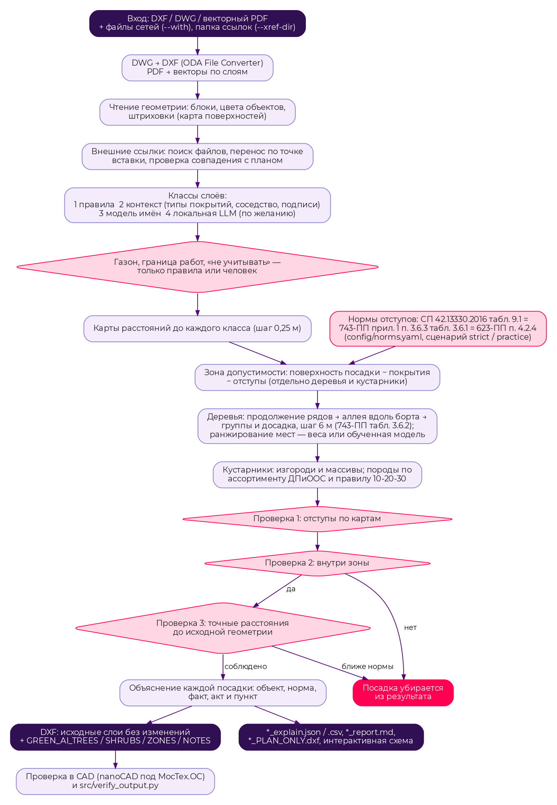

# GreenAI — сопроводительная документация

Сервис автоматического проектирования озеленения города с учётом расположения
подземных коммуникаций и городской среды. Кейс Департамента природопользования
и охраны окружающей среды города Москвы, хакатон «Лидеры цифровой
трансформации 2026». Команда «Бутерброд».

Репозиторий: https://github.com/Kaban425/greenai

---

## 1. Назначение и границы решения

Сервис принимает чертёж участка улицы (DXF, DWG или векторный PDF с подосновой и
коммуникациями), строит карту «где можно сажать» по нормативным отступам и
автоматически расставляет деревья и кустарники. Результат — DXF, в котором
исходные слои не изменены, а посадки, зоны допустимости и пометки лежат на
отдельных слоях `GREEN_AI_*`, и файлы объяснений: к каждой посадке —
определяющее ограничение, норма, фактическое расстояние, акт и пункт.

**Входит в MVP**

* чтение DXF, DWG (через ODA File Converter), векторного PDF со слоями CAD;
  автоматическая подгрузка внешних ссылок (xref) — топосъёмки, сетей ДЖКХ,
  бортового камня, заливок;
* распознавание слоёв: правила, контекст чертежа, обученная модель имён,
  локальная языковая модель (необязательна);
* отступы от сетей, дорог, зданий, опор, существующих деревьев по
  СП 42.13330.2016 табл. 9.1, ППМ № 743-ПП и ППМ № 623-ПП (МГСН 1.02-02);
  охранная зона ВЛ по ПП РФ № 160;
* деревья (аллеи вдоль борта, продолжение рядов существующих деревьев,
  группы) и кустарники (изгороди, массивы);
* три проверки норм, объяснение каждой посадки, отчёты JSON, CSV, Markdown;
* параметры: сценарий норм, шаг, породы, плотность; повторный прогон;
* веб-интерфейс с редактором посадок, HTTP API со Swagger, командная строка,
  Docker.

**Оставлено на развитие**

* данные публичных кадастров и data.mos.ru (границы участков, охранные зоны);
* отдельный слой травянистых покрытий (газон распознаётся и используется
  как поверхность посадки, но отдельным слоем не выгружается);
* фотореалистичные визуализации (бонус ТЗ);
* запуск непосредственно на МосТех.ОС (проверено в Linux-контейнере Debian).

## 2. Архитектура



| Компонент | Модули | Назначение |
|---|---|---|
| Чтение чертежа | `dxf_io.py`, `xref_load.py`, `pdf_import.py` | DXF/DWG/PDF → геометрия по слоям; блоки раскрываются, цвета объектов выделяются в подслои, внешние ссылки подгружаются с переносом по точке вставки |
| Распознавание слоёв | `layers.py`, `context_classify.py`, `geo_classify.py`, `layer_model.py`, `llm_layers.py` | имя слоя → класс объекта (сеть, дорога, газон, дерево…) |
| Карта ограничений | `raster_engine.py`, `config/norms.yaml` | растровые карты расстояний, зоны допустимости для деревьев и кустарников |
| Размещение | `raster_engine.py` (`place_rows`, `existing_row_extensions`, `fill_remaining`, `shrub_massifs`), `learn.py`, `assortment.py` | точки посадки, породы по правилу 10-20-30 и ассортименту ДПиООС |
| Проверки | `main.py`, `raster_engine.vector_audit`, `validate.py` | три проверки норм, сверка с посадочными планами проектировщиков |
| Выгрузка | `dxf_io.write_result`, `report.py`, `viewer.py` | DXF со слоями `GREEN_AI_*`, объяснения, отчёты, интерактивная схема |
| Интерфейсы | `main.py` (CLI), `webapp.py` (FastAPI, веб-интерфейс, Swagger), `batch_streets.py` | запуск расчёта, просмотр, правка, прогон по многим улицам |

**Поток данных.** Входной файл → геометрия по слоям (+ внешние ссылки) → классы
слоёв → карты расстояний до каждого класса (шаг 0,25 м) → зона допустимости =
поверхность посадки минус отступы → точки посадки → три проверки → DXF и
объяснения.

**Развёртывание.** Один Docker-образ (`Dockerfile`, `docker-compose.yml`) на базе
Debian: Python 3.12, зависимости из `requirements.txt`, ODA File Converter для
Linux с виртуальным дисплеем (DWG читается в контейнере). Порт 8000: веб-интерфейс
и API, Swagger на `/docs`. Тома: `./input` — входные чертежи, `./output` —
результаты, `greenai-cache` — сконвертированные DWG. Kubernetes не используется.
Внешних сетевых сервисов нет; языковая модель (Ollama) необязательна и работает
локально.

## 3. Алгоритм

### 3.1 Логика

1. **Чтение.** Все объекты пространства модели по слоям; вставки блоков
   раскрываются рекурсивно (объект на слое «0» внутри блока получает слой
   вставки); объекты своего цвета выделяются в подслой «слой@@#rrggbb»;
   штриховки дают карту поверхностей. Внешние ссылки ищутся по пути из чертежа
   и по имени в папке проекта; из нескольких вставок одной ссылки берётся та,
   чья геометрия ложится на план.
2. **Распознавание слоёв**, от строгого к гибкому:
    * правила по именам (соглашения Мосгеотреста и ДЖКХ, разделов ДВ, Civil 3D,
        чертежей из PDF) — основа;
    * контекст: номера типов покрытий, соседство с уже распознанными линиями,
        подписи у линий («К1», «Т2», «КЛ»);
    * модель имён (TF-IDF + k ближайших, 19,5 тыс. размеченных слоёв 20 улиц;
        точность 97,5 % при охвате 65 % на незнакомых именах);
    * локальная языковая модель через Ollama — только подсказка (78 %).

    Классы, расширяющие зону посадки (газон, граница работ, «не учитывать»),
    назначают только правила или человек: модель не может разрешить посадку.

3. **Карты расстояний.** Для каждого класса объектов строится растр расстояний
   (distance transform, `scipy.ndimage`), ячейка 0,25 м (на больших чертежах
   растёт, чтобы уложиться в память).
4. **Зона допустимости.** Поверхность посадки (газоны по заливкам и контурам, в
   границе работ) минус покрытия и застройка минус отступы — отдельно для
   деревьев и кустарников.
5. **Расстановка деревьев** (приоритеты по порядку):
    1. продолжение рядов существующих деревьев с их же шагом (3+ дерева на прямой,
      шаг 4–12 м);
    2. аллея вдоль борта: ряд на постоянном отступе от проезжей части (ближайший
      допустимый + 0,5 м), повторяющий изгибы улицы;
    3. широкие зоны — шахматная сетка вдоль оси зоны; остаток — досадка с
      соблюдением шага.

    Шаг деревьев 6 м (743-ПП, п. 3.6.4, табл. 3.6.2), в узких полосах —
    компактные породы. Места внутри зоны ранжируются ручными весами или
    моделью, обученной на посадочных планах пилота (логистическая регрессия с
    пороговыми признаками; AUC 0,85 на улице, которую модель не видела). Модель
    нормы не меняет.

6. **Кустарники** — изгороди вдоль проезжей части и массивы там, где дереву нельзя.
7. **Породы** — из ассортимента ДПиООС с учётом тени и ширины полосы, правило
   10-20-30 (вид / род / семейство).
8. **Три проверки норм:** (1) отступы по картам расстояний; (2) точка внутри
   итоговой зоны своего типа; (3) точное расстояние до исходных линий чертежа
   без растра. Посадка, не прошедшая 2-ю или 3-ю проверку, в результат не
   попадает.
9. **Выгрузка.** Исходные слои не меняются. Слои результата:
   `GREEN_AI_TREES`, `GREEN_AI_SHRUBS` (блоки с атрибутами ID, PORODA, NORMA),
   `GREEN_AI_ZONES`, `GREEN_AI_NOTES`; отдельный файл `*_PLAN_ONLY.dxf` — только
   посадки. DXF R2013, единицы — метры.

**Нормы отступов** (минимальное расстояние до оси растения, м):

| Объект | Дерево | Кустарник |
|---|---|---|
| Наружная стена здания и сооружения | 5,0 | 1,5 |
| Стена школы, детского сада | 10,0 | 1,5 |
| Край проезжей части, обочины | 2,0 | 1,0 |
| Край тротуара, садовой дорожки | 0,7 | 0,5 |
| Мачта, опора освещения | 4,0 | — |
| Подошва откоса | 1,0 | 0,5 |
| Подпорная стенка | 3,0 | 1,0 |
| Ось трамвайных путей | 5,0 | 3,0 |
| Газопровод, канализация | 1,5 | — |
| Теплосеть | 2,0 | 1,0 |
| Водопровод, дренаж | 2,0 | — |
| Силовой кабель, кабель связи | 2,0 | 0,7 |

Источник: СП 42.13330.2016, табл. 9.1; те же значения — Правила создания,
содержания и охраны зелёных насаждений (ППМ № 743-ПП, прил. 1, п. 3.6.3,
табл. 3.6.1, со ссылкой на МГСН 1.01-99); МГСН 1.02-02 (ППМ № 623-ПП), п. 4.2.4
требует обеспечивать эти расстояния при проектировании озеленения. Прочерк —
норма не установлена; для кустарника над сетью закладывается полоса обслуживания
1 м как проектное допущение. Справочник — `config/norms.yaml`, меняется без
изменения кода. Сценарии: `strict` — буква норм (по умолчанию); `practice` —
отступы, с которыми фактически сажают проектировщики пилота (не норматив,
помечается как требующий согласования); `root_barrier` — с корнезащитным экраном.

### 3.2 Интерпретируемость

Для каждой посадки в её точке вычисляются расстояния до всех нормируемых
объектов в радиусе 30 м. Определяющее ограничение — объект с наименьшим запасом
до нормы. Объяснение формируется из справочника норм: название объекта, норма,
факт, акт и пункт. Пример:

> T-214, ель колючая, Камчатская улица. Посадка (дерево) допустима. Определяющее
> ограничение — силовой кабель и кабель связи: требуется не менее 2,0 м,
> фактически 3,16 м (СП 42.13330.2016, таблица 9.1; ППМ № 743-ПП, прил. 1,
> п. 3.6.3, табл. 3.6.1 (МГСН 1.01-99); ППМ № 623-ПП (МГСН 1.02-02), п. 4.2.4).
> Прочие проверенные отступы: существующее дерево — 5,27 м при норме 4,0 м; стена
> здания — 10,08 м при норме 5,0 м.

Где лежат объяснения: `*_explain.json` (все посадки и все проверки),
`*_explain.csv`, `*_report.md`, атрибут NORMA блока посадки в DXF (краткая форма
до 255 символов). Для пустых участков газона указывается, какая норма их закрыла.
Проектные допущения (колодцы, существующие деревья, малые формы) помечаются как
допущения, а не как норматив.

### 3.3 Схема процесса

Схема в начале раздела 2 (исходник — `docs/process.dot`, `docs/process.mmd`).

## 4. Методы и библиотеки

| Что | Зачем | Источник |
|---|---|---|
| ezdxf | чтение и запись DXF, блоки, атрибуты | https://ezdxf.mozman.at |
| ODA File Converter | DWG → DXF | https://www.opendesign.com/guestfiles/oda_file_converter |
| shapely | геометрия, точные расстояния | https://shapely.readthedocs.io |
| NumPy, SciPy | растры, distance transform, kd-деревья | https://numpy.org, https://scipy.org |
| pypdf | извлечение векторов из PDF | https://pypdf.readthedocs.io |
| PyYAML | справочники норм и пород | https://pyyaml.org |
| FastAPI, Uvicorn | веб-интерфейс, HTTP API, Swagger | https://fastapi.tiangolo.com |
| Ollama + Qwen3 8B, bge-m3 (необязательно) | подсказка классов незнакомых слоёв | https://ollama.com |
| Логистическая регрессия (своя реализация на NumPy) | модель выбора места, проверка «без одной улицы» | `src/learn.py`, `src/train_placement.py` |
| TF-IDF + k ближайших (своя реализация) | модель имён слоёв | `src/layer_model.py` |

## 5. Сборка, запуск и проверка

```bash
git clone https://github.com/Kaban425/greenai && cd greenai
docker compose build
docker compose up                  # веб-интерфейс http://localhost:8000, Swagger /docs
```

Расчёт из командной строки (результат — в `./output/run1`):

```bash
docker compose run --rm greenai python src/main.py \
    --input data/sample.dxf --outdir output/run1
```

Свой чертёж кладётся в `./input`. Комплект с внешними ссылками монтируется
целиком:

```bash
docker run --rm -v "/путь/к/комплекту:/app/input/obj:ro" -v "$PWD/output:/app/output" \
    greenai:latest python src/main.py --input "input/obj/Генплан.dwg" --outdir output/obj
```

Основные параметры: `--scenario strict|practice|root_barrier`, `--spacing 6`,
`--tree`/`--shrub` (породы), `--trees-per-ha`, `--max-trees`, `--no-shrubs`,
`--with <файл сетей>`, `--xref-dir <папка ссылок>`, `--learned` (обученная модель
места), `--plan-only` (отдельный DXF только с посадками), `--validate` (сверка с
проектными посадками из того же чертежа).

**Проверка результата.**

```bash
python src/verify_output.py <входной.dwg> <папка результата>   # слои целы, атрибуты, объяснения
python -m pytest tests                                          # или python tests/test_*.py
python src/benchmark.py                                         # эталонный чертёж с известной разметкой
python src/batch_streets.py "<папка Пилотный проект 20 улиц>"   # прогон по всем улицам
```

## 6. Способ взаимодействия

* **Командная строка** — `src/main.py`, все параметры расчёта.
* **Веб-интерфейс** — загрузка файла, просмотр чертежа и слоёв, назначение
  классов слоям, запуск, сводка с проверкой результата, интерактивная схема,
  редактор посадок (перенос, добавление, удаление с проверкой норм; правки —
  в отдельном файле `*_EDITED.dxf`), страница «Улицы» с итогами прогона.
* **HTTP API** — см. раздел 7.

## 7. HTTP API (Swagger)

Спецификация OpenAPI — `/openapi.json`, интерфейс Swagger — `/docs`.

| Метод | Путь | Назначение |
|---|---|---|
| GET | `/api/version` | версия сборки и пути |
| GET | `/api/inputs` | файлы, готовые к анализу |
| GET | `/api/species` | каталог пород |
| POST | `/api/upload` | загрузить файл в папку input |
| POST | `/api/run` | запустить расчёт (параметры формы — как у CLI) |
| GET | `/api/jobs/{job_id}` | состояние и журнал расчёта |
| GET | `/api/summary/{folder}` | ключевые показатели расчёта |
| GET | `/api/results` | список результатов |
| GET | `/api/layers` | слои файла и их классы |
| POST | `/api/layers` | сохранить сопоставление слоёв |
| GET, POST | `/api/plan/{folder}` | план посадок для редактора, сохранение правок |
| POST | `/api/delete`, `/api/delete_result` | удалить входной файл или результат |
| GET | `/file/{folder}/{name}` | скачать файл результата |

## 8. Результаты на «Пилотном проекте 20 улиц», ограничения и известные ошибки

Строгий сценарий, прогон `src/batch_streets.py` по всем улицам (главный чертёж
выбирается автоматически, внешние ссылки и файлы сетей подгружаются сами):

| Улица | Деревьев | Кустарников | Нарушений | Убрано точной проверкой | Нераспознано, % длины | Внешних ссылок | Время, с |
|---|---|---|---|---|---|---|---|
| 1. Олимпийская деревня | 864 | 3000 | 0 | 0 | 3,7 | 12 | 569 |
| 2. Песчаный переулок | 6 | 371 | 0 | 0 | 0,0 | 29 | 52 |
| 3. 3-я Парковая | 422 | 2996 | 0 | 7 | 0,3 | 4 | 312 |
| 4. Харьковская улица | 94 | 2959 | 0 | 0 | 0,0 | 49 | 394 |
| 5. Багрицкого улица | 23 | 1288 | 0 | 0 | 0,1 | 27 | 110 |
| 6. Камчатская улица | 298 | 3000 | 0 | 0 | 0,1 | 4 | 177 |
| 7. Нижние Поля | 12 | 407 | 0 | 0 | 0,0 | 3 | 263 |
| 8. Лодочная | 5 | 543 | 0 | 0 | 0,1 | 18 | 268 |
| 9. Измайловская площадь | 247 | 3000 | 0 | 0 | 0,9 | 3 | 423 |
| 10. Старый Гай | 63 | 2353 | 0 | 0 | 1,6 | 9 | 160 |
| 11. Фрунзенская набережная (PDF) | 2 | 258 | 0 | 0 | 0,0 | — | 183 |
| 12. Наташинский проезд | 11 | 887 | 0 | 0 | 0,0 | 25 | 130 |
| 13. Харьковский проезд | 216 | 3000 | 0 | 0 | 0,1 | 8 | 199 |
| 14. Куликовская улица | 72 | 1476 | 0 | 0 | 18,8 | 2 | 152 |
| 15. Академика Понтрягина | 498 | 3000 | 0 | 0 | 3,3 | 0 | 27 |
| 16. улица Берзарина | 143 | 1811 | 0 | 0 | 1,8 | 0 | 236 |
| 17. Грузинская М. ул. | 0 | 26 | 0 | 0 | 0,0 | 21 | 159 |
| 18. Кустанайская улица | 66 | 3000 | 0 | 0 | 0,0 | 7 | 132 |
| 19. 2-я Прядильная | 487 | 3000 | 0 | 0 | 0,1 | 5 | 115 |
| 20. Макеева | 248 | 3000 | 0 | 0 | 0,0 | 0 | 195 |

Итого 20 улиц из 20, 3 777 деревьев и 39 375 кустарников, нарушений норм в
готовых планах 0, медиана времени 3 мин. Число кустарников ограничено параметром
`--max-shrubs 3000`.

**Сравнение с проектировщиками.** Посадочные планы пилота проверены теми же
нормами: на Камчатской 67 % деревьев проектировщика стоят ближе 2 м к кабелю
(медиана 1,27 м). Поэтому по строгим нормам деревьев часто меньше, чем в проекте,
и стоят они в других местах. Сценарий `practice` воспроизводит фактические
отступы проектов; это не норматив.

**Ограничения и допущения**

* Строгие нормы на плотных улицах оставляют мало мест: Грузинская — газоны на
  93 % закрыты отступами от кабелей, Лодочная — на 82 %.
* Чертежи, переведённые из PDF со слитой в один слой топосъёмкой, распознаются
  хуже (Куликовская — 18,8 % длины линий без класса). Такие смешанные слои
  не становятся сетью по подписям или соседству.
* Растр 0,25 м на больших чертежах укрупняется (до 0,84 м на 3-й Парковой);
  расхождение до половины ячейки ловит точная проверка и убирает посадку.
* Отступ между существующим и новым деревом (4 м), от колодцев и малых форм —
  проектные допущения: таблица их не устанавливает.
* Примечание к табл. 9.1 об увеличении отступов для крон больше 5 м реализовано
  коэффициентом `--crown-correction` (по умолчанию выключен).
* Фрунзенская набережная представлена только PDF-листами. Геометрия берётся
  из векторного PDF генплана (слои CAD в нём сохранены), расчёт идёт по одному
  листу. Деревьев 2: газоны там на 91 % закрыты отступами от кабелей и на 59 % —
  от существующих деревьев.

**Известные ошибки**

* Внешние ссылки, файлы которых не вошли в комплект или лежат в другой системе
  координат, пропускаются. На Олимпийской деревне подгружено 12 ссылок из 36:
  17 файлов нет в комплекте, 7 не совпадают с планом по координатам. Раздел
  «Внешние ссылки» отчёта `*_report.md` перечисляет каждую ссылку и причину
  пропуска.
* Модель имён ошибается на смешанных слоях без явного смысла («Слой1», «0»);
  такие имена не назначаются автоматически и ждут ручной разметки.
